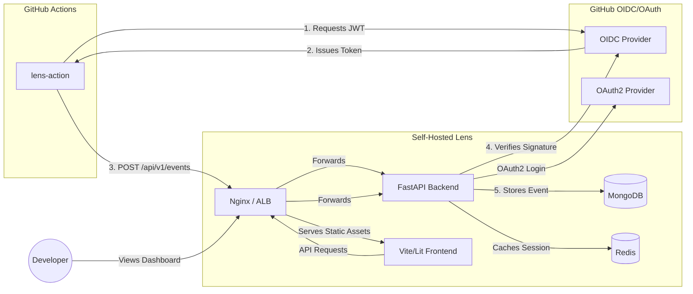

# Lens

An open-source tool for flexibly visualizing events, tracking metrics, and tracing the entire lifecycle of your artifacts across multiple repositories by leveraging Actions in git. 

## Key Features

- **Polyrepo Artifact Tracking**: See how code, versions, and deployments flow across your entire organization's repositories.
- **Secure OIDC Ingestion**: No more API keys. Lens securely verifies telemetry from GitHub Actions using native OIDC federation.
- **Fast, Modern Dashboard**: Built with Vite and Lit, providing real-time filtering, metric tracking, and deployment tracing.
- **Agnostic Architecture**: Deploy anywhere. Use Docker Compose for a quick single-node setup, or deploy directly to Kubernetes and AWS ECS.

## Inspiration

DevOps often preaches providing immediate feedback by shifting checks left in the development cycle so mistakes are caught and fixed faster. Another goal is breaking down organizational silos so that everything can be understood by everyone who has a stake.

An issue I have consistently run into is a lack of that immediate feedback and dealing with siloed information when it comes to git repositories and their artifacts. This leaves me with a limited understanding of how repositories are grouped, unable to view the metrics I care about, or track an artifact, like an application version, across multiple repositories without significant friction.

## Ecosystem Overview

Lens uses a modular, polyrepo architecture. This repository serves as the official front door, while the actual application logic is broken down into the following core components:

- [**`lens-backend`**](https://github.com/nickdchristian/lens-backend): The core FastAPI backend that stores deployment data and handles OAuth2.
- [**`lens-frontend`**](https://github.com/nickdchristian/lens-frontend): The visual dashboard built with Vite and Lit.
- [**`lens-action`**](https://github.com/nickdchristian/lens-action): The official GitHub Action that securely sends deployment events to the Lens backend.
- [**`lens-quickstart`**](https://github.com/nickdchristian/lens-quickstart): The official deployment templates and configuration guides for self-hosting.

## Architecture & Data Flow

Lens utilizes a modern, decentralized architecture:

## Quick Start / Deployment

Ready to deploy Lens for your team? We've created a dedicated deployment repository that contains everything you need to get up and running securely in under 5 minutes.

👉 **[Go to the Lens Quickstart Repository](https://github.com/nickdchristian/lens-quickstart)**

The quickstart includes:
- A `setup.sh` script to auto-generate cryptographic secrets.
- A vendor-agnostic `docker-compose.yml` pulling our pre-built `ghcr.io` images.
- An `nginx.conf` template for reverse proxying and handling `X-Forwarded-Proto` HTTPS headers.
- Comprehensive guides for both single-node servers and cloud-native (AWS/Kubernetes) deployments.

## Contributing & Issues

Since Lens is split across multiple repositories, we use **this** repository as the central hub for all issue tracking. 

Whether you've found a bug in the web UI, the backend API, or the GitHub Action, please [open an issue here](https://github.com/nickdchristian/lens/issues/new)!
